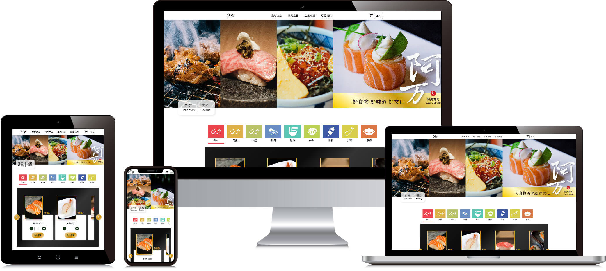

# aWan 阿万壽司網站開發介紹

本專案以壽司線上外帶預約做為發想，其開發內容包含視覺設計、前端程式設計及前端 UI CSS RWD自適應設計、後端程式設計，視覺設計內容包含網頁視覺設計、logo、DM、Banner，前端程式包含HTML網頁架構設計、JQuery&JavaScript程式設計、CSS樣式暨自適應設計，後端程式開發包含資料庫架構與API程式設計。

網頁程式面以購物車線上外帶預約功能為主要開發方向以API及JQuery&JavaScript互相配合，渲染到前端網頁，其功能有：

1. 註冊會員
(1). 帳號設定: 程式設定只能使用英文或數字3~12字設定，且未有人使用過。
	(2). 密碼設定: 程式設定只能使用英文或數字或符號符號.-@之8-12字密碼，且確認密碼欄位輸入必須與設定密碼欄位相同。
	(3). 會員姓名、暱稱、電話號碼: 程式設定均有字數限制。
	(4). E-mail: 格式設定。
	(5). 出生年月日: 僅可選擇今日前一日。
2. 登入/登出
.
.
.
<h2><a href="https://docs.google.com/document/d/1hT8OUZ6Ijitg0pnuB5gzptYKvf8rxO2xz2slOPrW1Xc/edit?usp=sharing" style="text-align: center;">>>了解更多A-Wan阿万壽司網站開發介紹</a></h2>

<h2><a href="https://gingerpai899.000webhostapp.com/index.html" style="text-align: center;">>>參觀A-Wan阿万壽司網站</a></h2>

